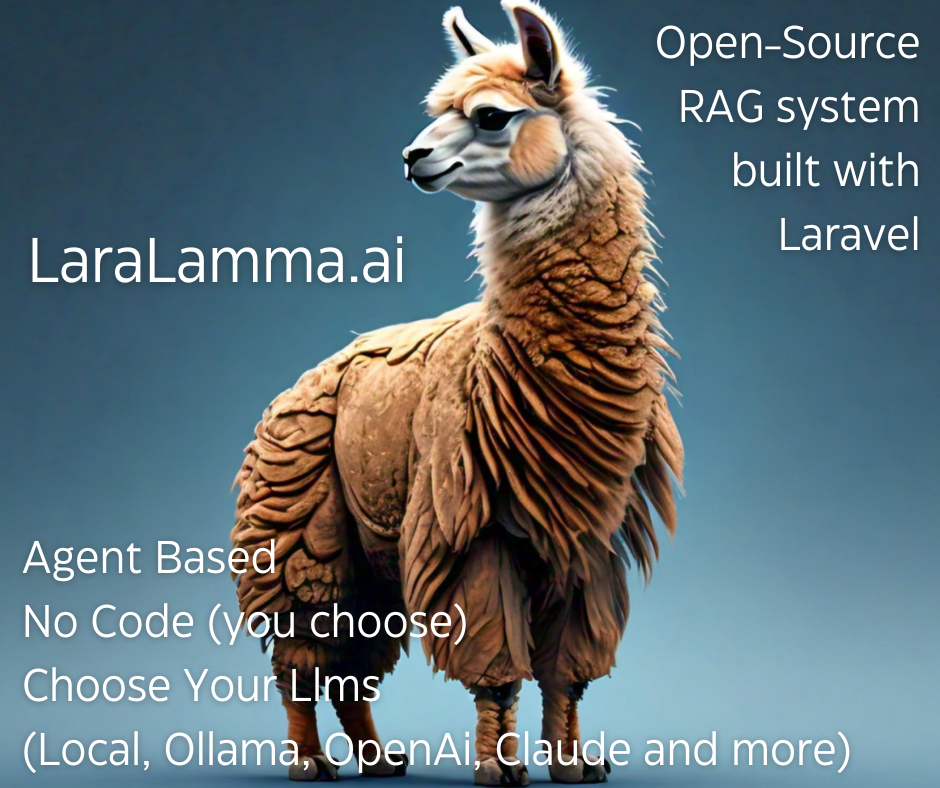

# LaraLamma.ai (LaraChain v2)



[](https://github.com/LlmLaraHub/laralamma/actions/workflows/ci-cd.yml)


This is a major update to LaraChain. Been working on other projects for the past year and going to do what I can to simplify the setup and foundation so anyone can get going embedding, search, and chatting with their data!

This will slowly be broken into modules you can use in your project but for now it is a standalone project that actually is super easy to setup, more on that below.

The core of this is a vector plugin for PostGres to simplify the setup. (no Docker). This setup will focus on Mac but others in Windows can make pull requests as needed to make it work there. Thanks to Laravel HERD this might even be easier with that since it has PostGres as well.

On top of this is Laravel's amazing Batching system to easily allow us to batch up jobs and manage the amount of jobs hit these LLMs at a time and in what order!


## Getting Started

Setup your local environment. I am going to use HERD to start off with. https://herd.laravel.com/
Because their services cost $ (which is well worth it imo) I will link to this to setup PostGres https://postgresapp.com/. Typically I default to DBEngine https://dbngin.com/ but I could not get the vector driver working. 

Just install the app like any Laravel App. Copy the .env.example to .env 

Make two database is Postgres (use TablePlus https://tableplus.com/ or some other too or cli) callec larachain and one called testing (this is so you do not wipe your database everytime youtest).

>NOTE: Laravel will offer to make the database if it does not exist but not with PostGres yet for me.

Ok then run this in TablePlus:

```sql
CREATE EXTENSION vector;
```

```php 
cp .env.example .env 
npm install
composer install
```

Update any secrets in the .env file

All set. Now you can migrate some starting data.

```php 
php artisan migrate:fresh --seed
```

Now to see it work:

```bash
php artisan horizon:watch
php artisan reverb:start --debug
npm run dev
```

We need Horizon since Batching is key.

## Road Map (still in motion)

You can see a lot of it [here](https://github.com/orgs/LlmLaraHub/projects/1)


## Some links for later
And just thinking how to make some of those flows work in a Laravel environment

## Videos

[Laravel as a Retrieval Augmented Generator system using OpenAi, Claude and Ollama NO CODE Larachain!](https://www.youtube.com/watch?v=rj5YQLbWF9U&t=8s)

## Articles 
[Laravel As A Retrieval Augmented Generator System](https://medium.com/@alnutile/laravel-as-a-retrieval-augmented-generator-system-f3afb64f86aa)

[Local LLM and Laravel in 10 minutes with Local LLM Embedding for free](https://medium.com/@alnutile/local-llm-and-laravel-in-10-minutes-with-local-llm-embedding-for-free-ac96e49288d2)


## Make sure to setup Reverb 

Per the Laravel docs https://laravel.com/docs/11.x/reverb


