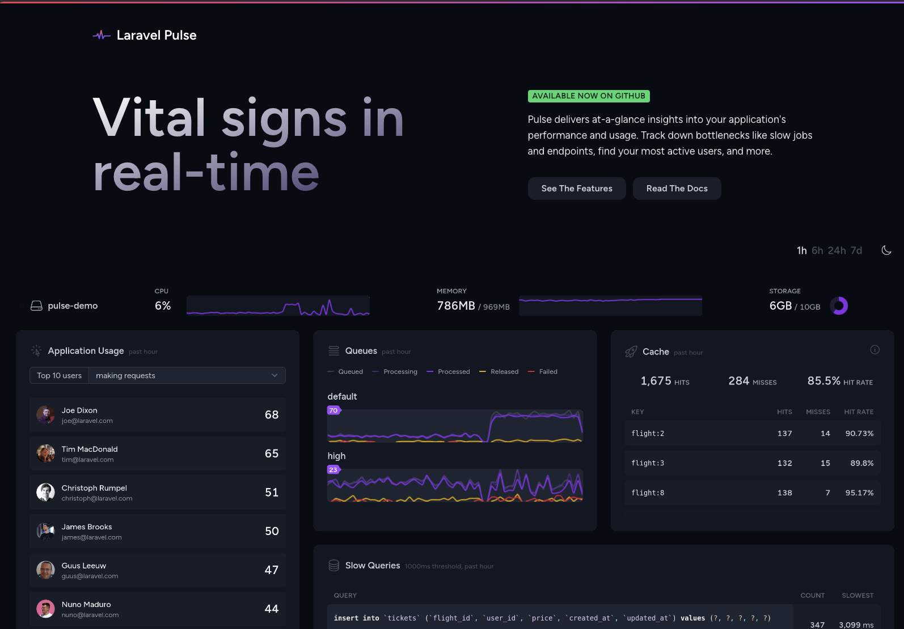

# Template Laravel Install


## Why

This will get any POC going quickly. It has the features needed for a solid proof of concept.


## What

### Deploy quickly and automatically
Using Github Actions

### Parallel Process and Scale as needed with Horizon Queues

### UI Charts and Dashboard with Interia JS
[https://inertiajs.com](https://inertiajs.com)

and 

[https://craftable.pro](https://craftable.pro)

## Charting with Apex Charts

[https://apexcharts.com](https://apexcharts.com)


## Team Manamagement and 2FA with JetStream

[https://jetstream.laravel.com/introduction.html](https://jetstream.laravel.com/introduction.html)


## How

### ENV Production
Using the Laravel docs [https://laravel.com/docs/10.x/configuration#encryption](https://laravel.com/docs/10.x/configuration#encryption)


## Local Setup
This is your typical Laravel install [https://laravel.com/docs/10.x/installation](https://laravel.com/docs/10.x/installation)
Since it uses Inertia you need to run `npm install` and then `npm dev` when working.


If you want to seed admin see `database/seeders/AdminSeeder`

```bash
php artisan db:seed --class=AdminSeeder
```

## Admin Dash
It is using [https://docs.craftable.pro/](https://docs.craftable.pro/)


## System Level info Pulse
`/pulse` you must be an admin user (more on that shortly)

[https://pulse.laravel.com/](https://pulse.laravel.com/)




## Queue System Horizon


## Forge on AWS

All of this is in Forge so we do not need to SSH or access the server

